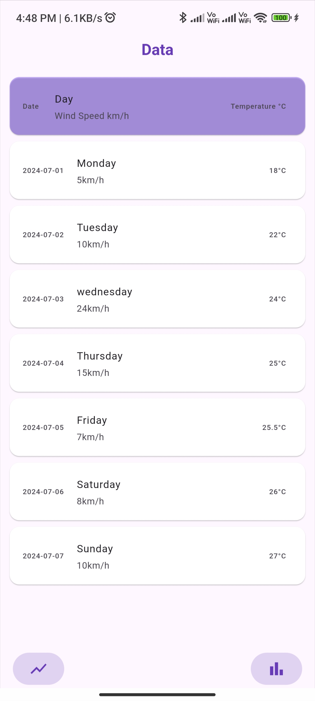
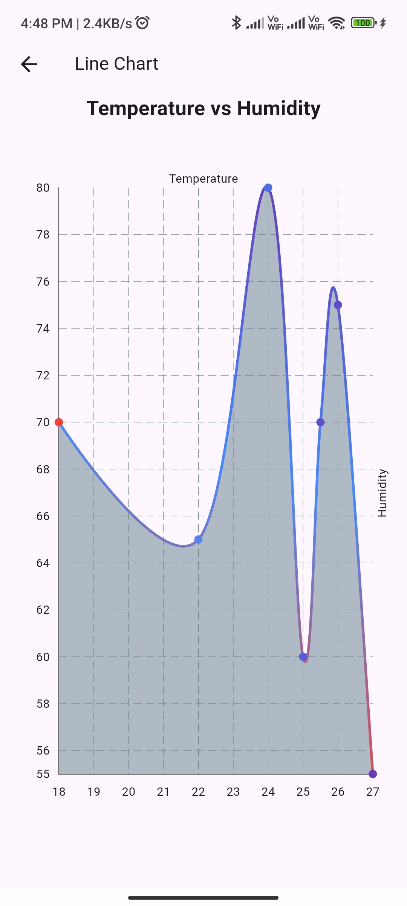
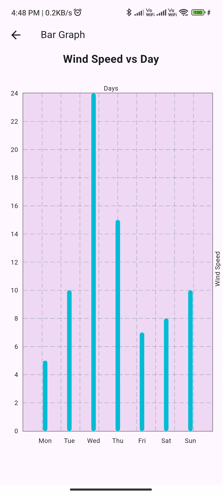

# Flutter Chart App

This Flutter application demonstrates the use of charts to visualize data. It includes a bar chart and a line chart to represent different types of data. The app reads data from a CSV file and displays it in a user-friendly manner.

## Features

- **Bar Chart**: Displays wind speed data across different days of the week.
- **Line Chart**: Shows the relationship between temperature and humidity.
- **Data Loading**: Utilizes a CSV file to load and parse data for visualization.

## Screenshots

<p align="center">
  
  
  
</p>

## Getting Started

To run this project, follow these steps:

1. Clone the repository to your local machine:
```bash
git https://github.com/Mohanish-25/chart_app.git
```

2. **Navigate to the project directory:**

```bash
cd chart_app
```

3. **Install dependencies:**

Make sure you have Flutter installed on your machine. Then, run the following command:

```bash
flutter pub get
```

4. **Run the app:**

Connect your device or use an emulator, then execute:

```bash
flutter run
```

## Dependencies

- `flutter`: The main SDK for building the app.
- `fl_chart`: A library used for creating the charts.
- `csv`: A library for parsing CSV files.
